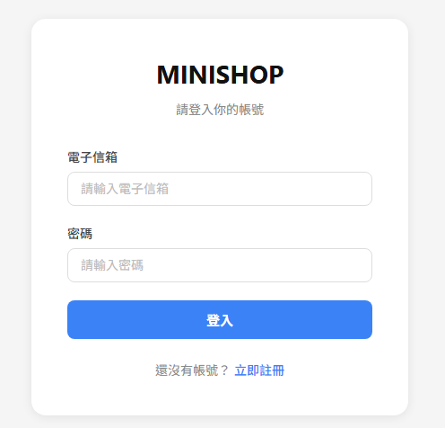
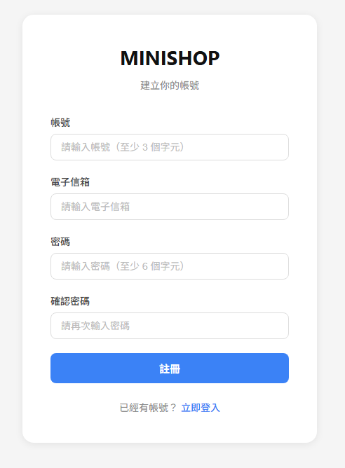
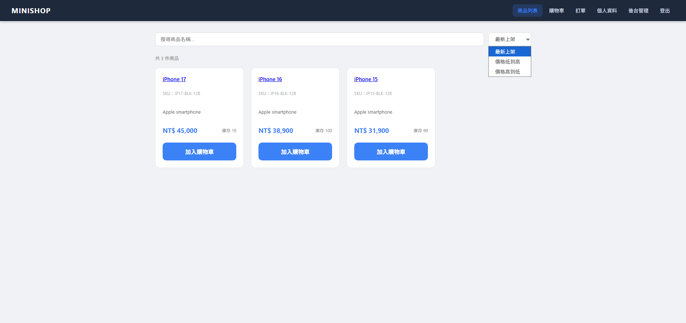
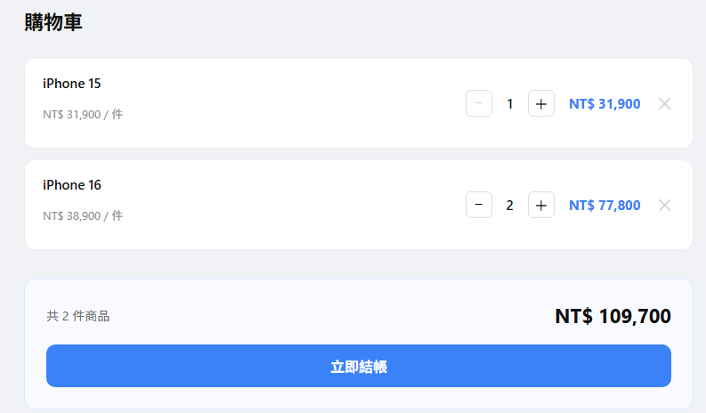
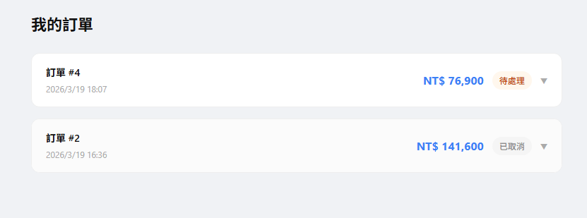
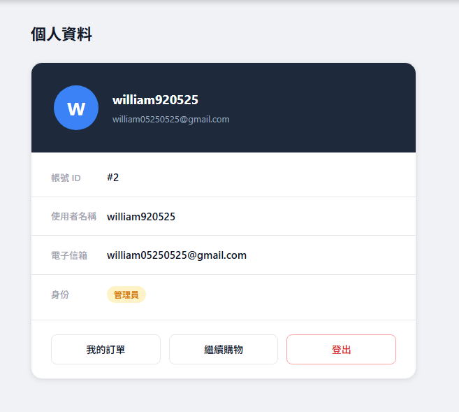
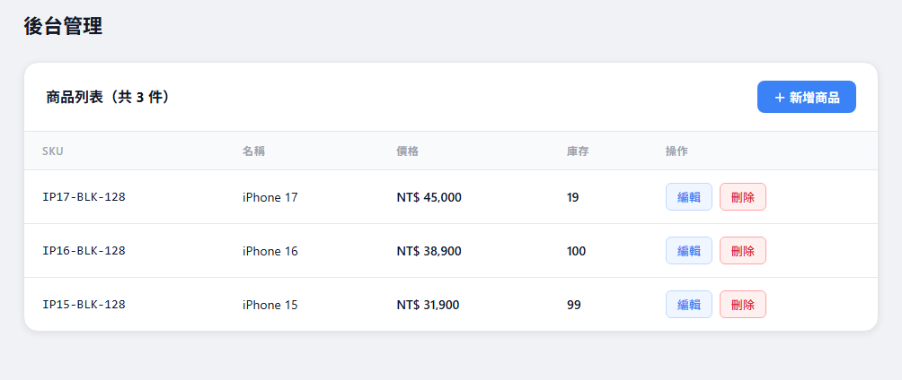

# 🛒 MiniShop 電商系統

一個使用 **Flask + React** 建立的全端電商專案，包含完整的後端 RESTful API 與前端單頁應用程式。  
本專案作為全端工程師學習與實作練習用途。

---

## 📌 專案說明

MiniShop 是一個簡易電商系統，實作了：

- 使用者驗證與權限控管
- 商品管理（含後台）
- 購物車系統
- 訂單處理
- RESTful API 設計
- React 前端串接

---

## 🚀 已完成功能

### 👤 使用者系統
- 使用者註冊 / 登入
- JWT 身份驗證
- 角色權限（admin / user）
- 個人資料查詢

### 🛍 商品系統
- 商品列表查詢（含搜尋、排序、分頁）
- 單一商品查詢
- 新增 / 修改 / 刪除商品（admin）

### 🛒 購物車系統
- 加入購物車
- 查看購物車（含商品資訊）
- 修改數量 / 刪除項目
- 結帳（自動扣庫存、建立訂單、清空購物車）

### 📦 訂單系統
- 建立訂單
- 查看個人訂單列表（含分頁）
- 查看訂單明細
- 取消訂單（僅限 pending 狀態，自動補回庫存）

### 🖥 前端頁面
- 登入 / 註冊頁
- 商品列表頁（搜尋、排序、分頁）
- 商品詳情頁
- 購物車頁
- 訂單頁
- 個人資料頁
- 後台商品管理頁（admin 限定）

---

## 🛠 使用技術

### 後端
- Python / Flask
- MySQL + SQLAlchemy
- Flask-JWT-Extended
- Flask-CORS
- RESTful API

### 前端
- React 19
- React Router DOM
- Axios
- 純 CSS

---

## 📁 專案結構

```
minishop/
├── backend/
│   ├── app.py
│   ├── config.py
│   ├── extensions.py
│   ├── models.py
│   ├── create_db.py
│   ├── routes/
│   │   ├── user.py
│   │   ├── product.py
│   │   ├── cart.py
│   │   └── order.py
│   └── utils/
│       └── auth.py
│
└── minishop-frontend/
    └── src/
        ├── pages/
        │   ├── LoginPage.jsx / .css
        │   ├── RegisterPage.jsx / .css
        │   ├── ProductListPage.jsx / .css
        │   ├── ProductDetailPage.jsx / .css
        │   ├── CartPage.jsx / .css
        │   ├── OrderPage.jsx / .css
        │   ├── ProfilePage.jsx / .css
        │   └── AdminPage.jsx / .css
        ├── components/
        │   ├── Navbar.jsx
        │   └── Navbar.css
        ├── context/
        │   └── AuthContext.jsx
        ├── services/
        │   ├── api.js
        │   ├── authService.js
        │   ├── productService.js
        │   ├── cartService.js
        │   └── orderService.js
        ├── App.js
        ├── global.css
        └── index.js
```

---

## 🔑 API 一覽

| 方法 | 路徑 | 說明 | 權限 |
|------|------|------|------|
| POST | `/register` | 使用者註冊 | 公開 |
| POST | `/login` | 使用者登入 | 公開 |
| GET | `/profile` | 取得個人資料 | 登入 |
| GET | `/products` | 商品列表 | 公開 |
| GET | `/products/:id` | 商品詳情 | 公開 |
| POST | `/products` | 新增商品 | Admin |
| PUT | `/products/:id` | 修改商品 | Admin |
| DELETE | `/products/:id` | 刪除商品 | Admin |
| GET | `/cart` | 查看購物車 | 登入 |
| POST | `/cart/items` | 加入購物車 | 登入 |
| PUT | `/cart/items/:id` | 修改數量 | 登入 |
| DELETE | `/cart/items/:id` | 刪除項目 | 登入 |
| POST | `/cart/checkout` | 結帳 | 登入 |
| GET | `/orders` | 訂單列表 | 登入 |
| GET | `/orders/:id` | 訂單詳情 | 登入 |
| PUT | `/orders/:id/cancel` | 取消訂單 | 登入 |
---

## 📸 截圖展示

### 登入 / 註冊



### 商品列表


### 購物車


### 訂單


### 個人資料


### 後台管理

